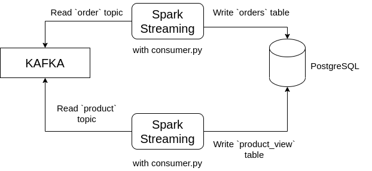

## Data Consumer

This system reads data from specific topics in Kafka using Spark streaming, cleans the data, and writes it to specific tables in PostgreSQL.

## Table of Contents

* [Installation](#installation)
* [System Operation](#system-operation)
* [How to Run](#how-to-run)
* [Limitations and Errors](#limitations-and-errors)

### Installation

First, you should have Kafka and Spark installed on your system. Spark installation will not be covered in this documentation. The `docker-compose` file I used is located in the root directory of the repository.

For Spark to be able to write the data it reads from Kafka to PostgreSQL, the `postgresql jdbc jar` is required. To download the jar file to your system, use the following command:

```
curl https://jdbc.postgresql.org/download/postgresql-42.2.5.jar --output postgresql-42.2.5.jar
```

To install the necessary Python libraries, use the following command:

```
pip3 install -r requirements.txt
```

### System Operation



As shown in the image above, Spark reads data from Kafka and writes it to PostgreSQL.

The data reading and writing process utilizes `spark-shell`. By running `consumer.py`, data transformation and writing to PostgreSQL are performed.

The `schema` values for transforming the data read by Spark are obtained from the `schemas.py` file based on the topic name. For example: schemas['order']. `consumer.py` retrieves the `schema` from the `schemas.py` file in this way.

The data cleansing operations for the data read by Spark are obtained from the `transforms.py` file based on the topic name. For example: transforms['order'] retrieves the function that performs the transformation for the orders.json data in the order topic. `consumer.py` obtains the function to be used for data transformation from `transforms.py` in this way.

`consumer.py` obtains the Kafka URL to which Spark will connect and the PostgreSQL connection information where Spark will write the data from the `config.yml` file using `config.py`.

`consumer.py` obtains the topic from which it will read data (--topic) and the table to which it will write data (--table) as arguments.

Below is the folder structure:

```bash
.
├── consumer.py
├── README.md
├── requirements.txt
└── src
    ├── config.py
    ├── config.yml
    ├── schemas.py
    └── transforms.py

1 directory, 7 files
```

### How to Run

```
spark-submit --packages org.apache.spark:spark-sql-kafka-0-10_2.12:3.1.2 --driver-class-path postgresql-42.2.5.jar consumer.py --topic order --table orders

spark-submit --packages org.apache.spark:spark-sql-kafka-0-10_2.12:3.1.2 --driver-class-path postgresql-42.2.5.jar consumer.py --topic product --table product_view
```

### Limitations and Errors

* Excessive Spark logging
* Dependency on topic name