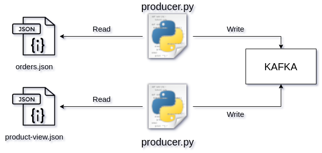

## Data Producer

This system is used to write files provided in the `ndjson` format to `Kafka` at regular intervals, such as every 60 seconds. The data written to `Kafka` is written as-is without any cleaning process.

## Table of Contents

* [Installation](#installation)
* [Operating System](#operating-system)
* [How to Run](#how-to-run)
* [Limitations and Issues](#limitations-and-issues)

### Installation

Firstly, you should have `Kafka` installed on your system. While developing this system, `docker` was used for `Kafka` installation. The `docker-compose` file I used can be found in the root directory of the repository.

You can install the necessary Python libraries for the system to work using the following command:

```
pip3 install -r requirements.txt
```

### Operating System



As seen in the above image, the `producer.py` file is executed multiple times to write specific `json` files to specific `Kafka` topics simultaneously.

The `producer.py` file obtains the `ndjson` formatted data in a `list` format using the `ndjson.py` script.

The `producer.py` file retrieves the URL on which `Kafka` is running from the `config.yml` file using `config.py`.

The `producer.py` file obtains which `ndjson` file to read (--file), to which `topic` to write the data (--topic), and at what interval (--second) the data should be written to `Kafka` using command-line arguments.

You can see the folder structure below.

```bash
.
├── producer.py
├── README.md
├── requirements.txt
└── src
    ├── config.py
    ├── config.yml
    └── ndjson.py

1 directory, 6 files
```

### How to Run

```
python3 producer.py --topic product --file data/product-views.json --second 1

python3 producer.py --topic order --file data/orders.json --second 60
```

### Limitations and Issues

1. The system only reads and writes data in the `ndjson` format. If a new format is to be added, changes need to be made to the system.
2. There are no unit tests.